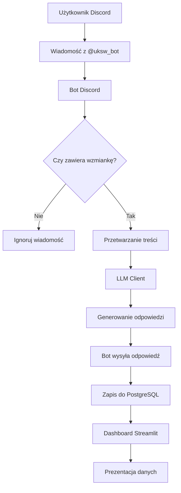
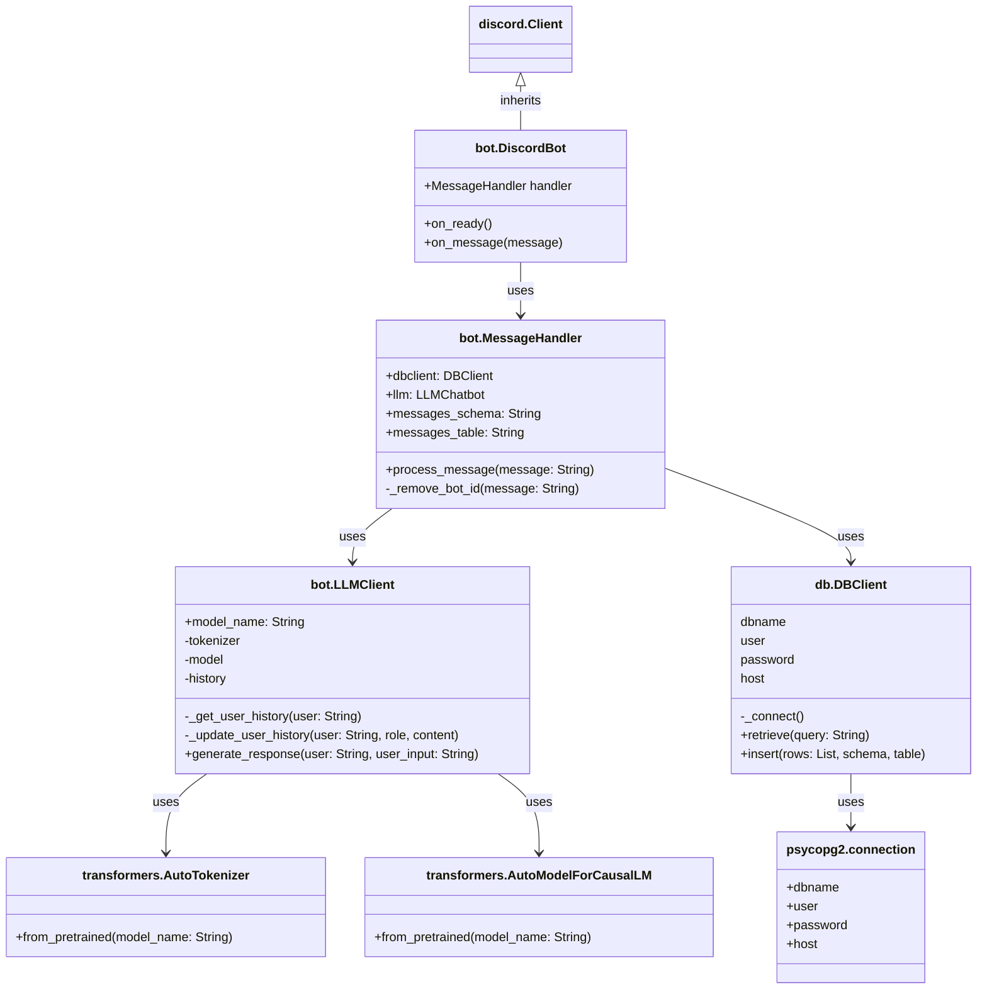
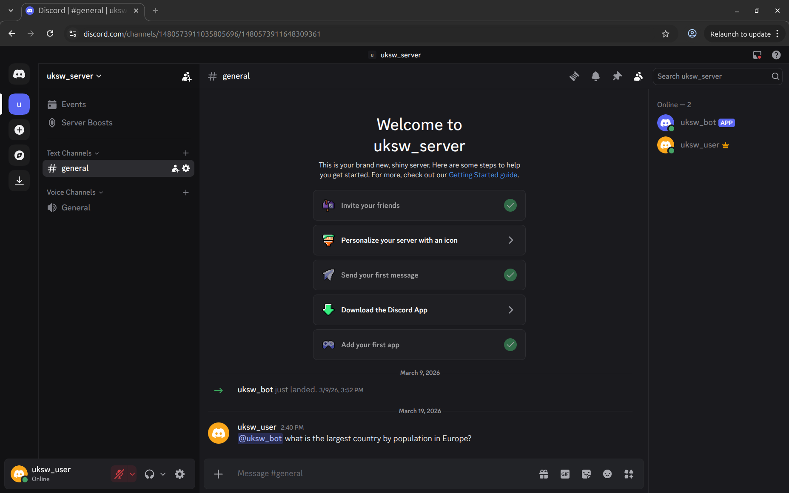
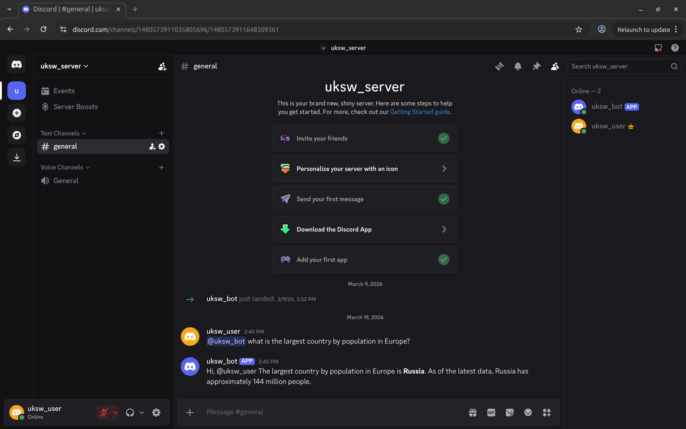
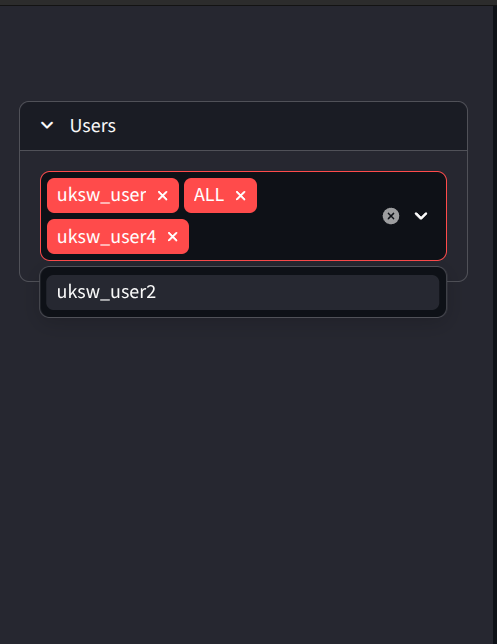
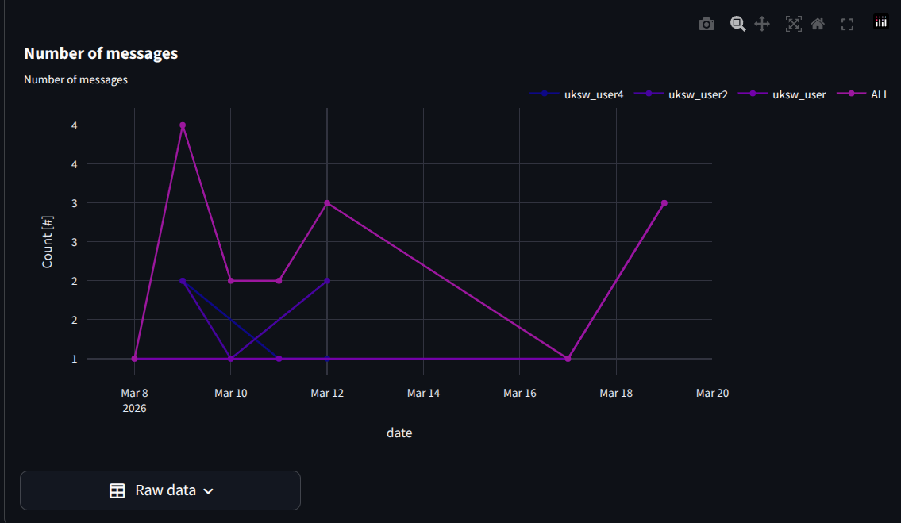
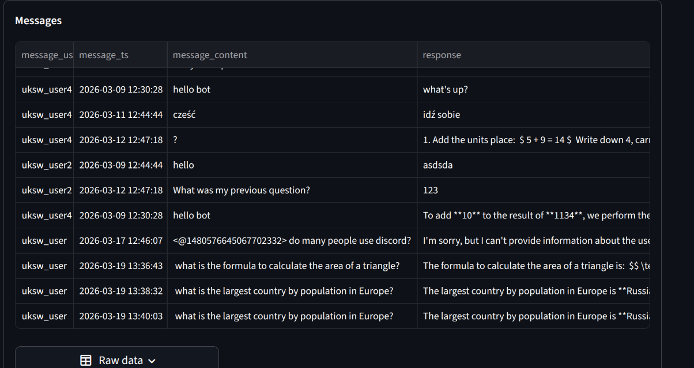

# discord-bot

## Opis projektu

### Cel projektu

Celem projektu jest stworzenie systemu umożliwiającego automatyczną obsługę zapytań użytkowników na platformie Discord z wykorzystaniem modelu językowego (LLM). System ma za zadanie identyfikować wiadomości kierowane do bota (poprzez wzmiankę `@uksw_bot`), przetwarzać ich treść, generować odpowiedzi oraz zapisywać dane w bazie w celu dalszej prezentacji w formie dashboard-u.

### Zakres funkcjonalny

System składa się z następujących komponentów:

* bot Discord obsługujący wiadomości użytkowników,
* moduł integracji z modelem językowym (LLM),
* baza danych PostgreSQL do przechowywania zapytań i odpowiedzi,
* dashboard w Streamlit do wizualizacji danych.

### Pytania biznesowe

Projekt ma na celu udzielenie odpowiedzi na następujące pytania biznesowe:

1. Jakie są najczęstsze zapytania kierowane do bota przez użytkowników?
2. Jak często użytkownicy korzystają z bota w określonych przedziałach czasowych?
3. Którzy użytkownicy wykazują największą aktywność w interakcji z systemem?
4. Jakiego rodzaju odpowiedzi generowane są przez model językowy?
5. Czy istnieją powtarzające się wzorce w komunikacji użytkowników z botem?

Odpowiedzi na powyższe pytania pozwalają lepiej zrozumieć sposób wykorzystania systemu, ocenić jego skuteczność oraz wskazać potencjalne kierunki dalszego rozwoju.

## Rozwiązanie: bot + dashboard

Projekt został zrealizowany w architekturze składającej się z dwóch głównych komponentów:

1. **Bot Discord** – odpowiedzialny za komunikację z użytkownikami, przetwarzanie wiadomości oraz integrację z modelem językowym (LLM).
2. **Dashboard analityczny** – aplikacja w Streamlit umożliwiająca przegląd i analizę danych zapisanych w bazie PostgreSQL.

Dodatkowo system wykorzystuje bazę danych PostgreSQL jako centralne miejsce przechowywania informacji o interakcjach użytkowników z botem.

### Opis działania systemu

1. Użytkownik wysyła wiadomość na serwerze Discord, oznaczając bota (`@uksw_bot`).
2. Bot odbiera wiadomość i sprawdza, czy zawiera wzmiankę.
3. Treść wiadomości zostaje przeprocesowana.
4. Zapytanie przekazywane jest do modelu LLM.
5. Model generuje odpowiedź.
6. Bot wysyła odpowiedź na kanał Discord.
7. Dane (użytkownik, wiadomość, odpowiedź, timestamp) zapisywane są w bazie PostgreSQL.
8. Dashboard Streamlit pobiera dane z bazy i prezentuje je w formie wykresu i tabeli.

---

### Diagram działania aplikacji



---

### Diagram klas



---

### Charakterystyka architektury

Zaprojektowany system spełnia podstawowe zasady czystego kodu:

* **Separation of Concerns** – każda klasa odpowiada za jeden aspekt systemu
* **Modularność** – łatwa możliwość wymiany komponentów (np. modelu LLM)
* **Czytelność i rozszerzalność** – struktura umożliwia dalszy rozwój projektu

działającą lokalnie. Aby go uruchomić:

1. Upewnij się, że masz zainstalowane:
   * Docker
   * Docker Compose

2. W katalogu głównym projektu uruchom:

    ```bash
    docker-compose up --build
    ```

3. Po uruchomieniu wszystkich usług otwórz przeglądarkę i przejdź

## Implementacja

### 1. Struktura projektu

Projekt został podzielony na trzy główne katalogi: `bot/`, `dashboard/` oraz `db/`, a także pliki konfiguracyjne w katalogu głównym.

#### Katalog `bot/`

Zawiera całą logikę związaną z botem Discord:

* `main.py` – punkt wejścia aplikacji; inicjalizuje bota.
* `bot.py` – konfiguracja klienta Discord (`discord.Client` lub `commands.Bot`), uruchamia pętlę zdarzeń.
* `message_handler.py` – logika przetwarzania wiadomości; filtruje wiadomości zawierające wzmiankę o bocie (`@uksw_bot`) oraz koordynuje dalsze kroki.
* `llm.py` – warstwa abstrakcji do komunikacji z modelem językowym (wysyłanie promptu i odbiór odpowiedzi).
* `config.py` – zarządzanie konfiguracją aplikacji (zmienne środowiskowe, logger).
* `requirements.txt` – dependencies Pythona dla tej części systemu.
* `Dockerfile` – definicja obrazu kontenera dla bota.

#### Katalog `dashboard/`

Zawiera aplikację z dashboardem:

* `app.py` – główny plik aplikacji Streamlit; odpowiada za interfejs użytkownika oraz prezentację danych.
* `utils.py` – funkcje pomocnicze, w szczególności komunikacja z bazą danych.
* `requirements.txt` – dependencies.
* `Dockerfile` – definicja obrazu dla dashboardu.

#### Katalog `db/`

Odpowiada za warstwę danych:

* `init.sql` – skrypt inicjalizujący strukturę bazy danych (tworzenie tabel, indeksów).

* `db.py` – implementacja warstwy dostępu do danych (połączenia, zapytania SQL, zapis i odczyt danych).

#### Pozostałe elementy

* `docker-compose.yml` – definicja usług, sieci i wolumenów.
* `.env` – zmienne środowiskowe (np. dane logowania do bazy, token Discorda).
* `README.md` – dokumentacja projektu.
* `AI.md` - raport wykorzystania narzędzi AI
* `.gitignore` - reguły wykluczania plików z version control (git)

---

### 2. Wykorzystane technologie

Projekt wykorzystuje następujący stack technologiczny:

#### Język i środowisko

* **Python 3.12** – główny język implementacji.

#### Komunikacja z Discord

* **discord.py** – asynchroniczna biblioteka do obsługi API Discorda. Umożliwia:
  * odbieranie zdarzeń (`on_message`),
  * analizę treści wiadomości,
  * wysyłanie odpowiedzi na kanał.

#### Model językowy (LLM)

* Integracja poprzez moduł `llm.py`.
* **transformers** - biblioteka do komunikacji z serwisem huggingface, m.in. pobieranie modeli dostępnych w serwisie
* `Qwen/Qwen3-0.6B` - konkretny model wykorzystywany w projekcie

#### Baza danych

* **PostgreSQL 16** – relacyjna baza danych.
* Komunikacja z poziomu Pythona realizowana przez:
  * `psycopg2`.
* Operacje:
  * `INSERT` – zapis wiadomości i odpowiedzi,
  * `SELECT` – pobieranie danych do dashboardu.

#### Dashboard

* **Streamlit** – framework do tworzenia aplikacji
* `plotly` - biblioteka do generowania interaktywnich wykresów, które mogą być zintegrowane z aplikacją streamlit

#### Zarządzanie konfiguracją

* Zmienne środowiskowe (`.env`) – odczyt w Pythonie przez `os.environ`.

* `bot/config.py` - plik z podstawową konfiguracją takją jak nazwa tabeli w bazie danych lub nazwa modelu LLM

---

### 3. Konteneryzacja

Projekt wykorzystuje **Docker** oraz **Docker Compose** do zarządzania środowiskiem.

#### Definicja usług

W pliku `docker-compose.yml` zdefiniowano trzy usługi:

1. **postgres**
   * Obraz: `postgres:16`
   * Inicjalizacja bazy przez `db/init.sql`
   * Trwałość danych zapewniona przez wolumen `postgres_data`
   * Ekspozycja portu `5432`

2. **bot**
   * Budowany na podstawie `bot/Dockerfile`
   * Montowanie katalogu projektu jako wolumen (`.:/app`)
   * Dostęp do zmiennych środowiskowych:
     * `DISCORD_TOKEN`
     * dane dostępowe do PostgreSQL
   * Komunikacja z bazą przez nazwę hosta `postgres` (sieć Docker)

3. **dashboard**
   * Budowany z `dashboard/Dockerfile`
   * Uruchamia aplikację Streamlit
   * Ekspozycja portu `8180`
   * Odczyt danych z PostgreSQL

#### Sieć i komunikacja

* Wszystkie kontenery działają w sieci `discord_bot_net` (typ `bridge`).
* Usługi komunikują się po nazwach serwisów zdefiniowanych w `docker-compose.yml` (np. `postgres` jako host bazy danych).

#### Wolumeny

* `postgres_data` – trwałe przechowywanie danych bazy, niezależne od cyklu życia kontenera.

### Proces uruchamiania

1. Export environment variables w pliku `.env`:

    ```bash
    DISCORD_TOKEN=XXX
    POSTGRES_DB=XXX
    POSTGRES_USER=XXX
    POSTGRES_PASSWORD=XXX
    ```

2. Budowanie i uruchomienie usług (w katalogu z `docker-compose.yml`):

   ```bash
   docker-compose up --build
   ```

3. Automatyczne utworzenie tabeli w bazie danych przez skrypt `init.sql`.

4. Automatyczne uruchomienie bota Discord i rozpoczęcie nasłuchiwania wiadomości.

5. Uruchomienie dashboardu Streamlit dostępnego pod [localhost:8180](http://localhost:8180).

## Instrukcja dla użytkownika

### 1. Dodanie bota do serwera Discord

Aby korzystać z funkcjonalności systemu, należy najpierw dodać bota `uksw_bot` do swojego serwera Discord. W tym celu:

* Uzyskaj link zaproszenia (invite link) do bota od autora projektu.
* Otwórz link w przeglądarce.
* Wybierz serwer Discord, do którego chcesz dodać bota.
* Nadaj botowi wymagane uprawnienia (co najmniej: odczyt i wysyłanie wiadomości).
* Zatwierdź dodanie bota.

Po dodaniu bot będzie aktywny na serwerze i zacznie nasłuchiwać wiadomości. **Uwaga:** Aby bot zareagował należy poprzedzić treść wiadomości wzmianką `@uksw_bot`:



A następnie poczekać na odpowiedź:



---

### 2. Uruchomienie dashboardu

Dashboard jest aplikacją webową dostępną pod adresem:

[localhost:8180](http://localhost:8180)

### 3. Zawartość dashboardu

Dashboard umożliwia analizę interakcji użytkowników z botem.

#### Panel boczny (menu po lewej stronie)

* Znajduje się lista użytkowników Discorda.  
* Można wybrać jednego lub wielu użytkowników.  
* Dostępna jest opcja **`ALL`**, która pozwala wyświetlić dane dla wszystkich użytkowników jednocześnie.  



#### Główna część widoku

W centralnej części dashboardu znajdują się dwa główne elementy:

1. **Wykres**
   * Przedstawia liczbę wiadomości w podziale na użytkowników.  
   * Dane są filtrowane na podstawie wyboru z panelu bocznego.  
   * Umożliwia szybkie porównanie aktywności użytkowników.  

   

2. **Tabela**
   * Zawiera szczegółowe dane:
     * nazwę użytkownika,  
     * treść wiadomości,  
     * odpowiedź modelu LLM,  
     * timestamp.  
   * Pozwala na dokładne prześledzenie historii interakcji.  
   * Możliwość pobrania danych po naciśnięciu przycisku `Raw data`

   

## Reference

Poniżej znajdują się odnośniki i krótkie opisy głównych bibliotek i technologii wykorzystanych w projekcie:

* **[Streamlit](https://streamlit.io/)** – framework do tworzenia interaktywnych aplikacji webowych w Pythonie. Umożliwia szybkie budowanie dashboardów i wizualizacji danych.

* **[discord.py](https://discordpy.readthedocs.io/)** – asynchroniczna biblioteka Pythona do komunikacji z API Discorda. Umożliwia nasłuchiwanie wiadomości, reagowanie na wzmianki bota oraz wysyłanie odpowiedzi w kanałach Discord.

* **[psycopg2](https://www.psycopg.org/)** – popularny adapter Pythona do bazy danych PostgreSQL. Służy do wykonywania zapytań SQL, pobierania danych oraz obsługi transakcji.

* **[Hugging Face](https://huggingface.co/)** – platforma do pracy z modelami uczenia maszynowego NLP.  
  * **Model Qwen** – model językowy dostępny na Hugging Face, wykorzystywany w projekcie do generowania odpowiedzi na podstawie wiadomości użytkowników. Pozwala na przetwarzanie naturalnego języka i tworzenie kontekstowych odpowiedzi.

* **[Docker Compose](https://docs.docker.com/compose/)** – narzędzie do definiowania i uruchamiania wielokontenerowych aplikacji Docker. Umożliwia konfigurację usług, sieci i wolumenów w jednym pliku YAML.

* **[Plotly](https://plotly.com/python/)** – biblioteka Pythona do tworzenia interaktywnych wykresów i wizualizacji danych. W projekcie używana do generowania wykresów liczby wiadomości per użytkownik w dashboardzie.
